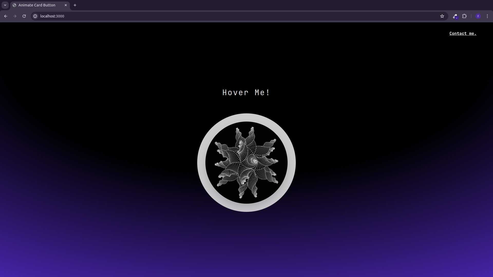

# Animate Card Button

# Installation

After cloning the repository or downloading the ZIP file, run one of the following commands to install the dependencies:

npm install

yarn

pnpm install

## Running the Project

To start the project in development mode, use one of the following commands:

yarn dev

npm run dev

pnpm dev

bun dev

The AnimateCardButton is a React component that leverages the framer-motion library to create an animated and responsive button. It responds to mouse movements by smoothly rotating along the X and Y axes as the cursor moves over it. Upon clicking, the button redirects the user to the projects page. The background animation and pulsation make the button visually appealing and interactive, providing a modern and engaging experience for React/Next.js web applications.

[Visit the Live Site](https://animate-card-button.vercel.app/)

